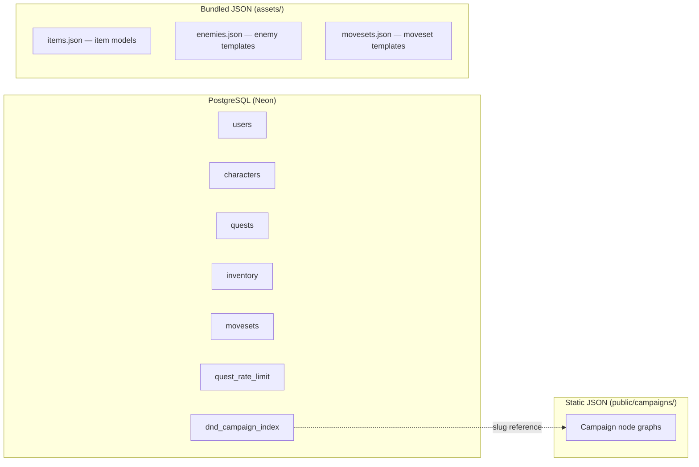

# Questmaker

> **What if your to-do list was a D&D campaign?**

Questmaker is a productivity app with a full RPG layer on top. Create a D&D avatar, complete real-life tasks as quests to earn coins, gear up at the shop, and play through a text-based campaign — with branching narrative, ability checks, and turn-based combat — all as your character.

**[→ Try the live demo](https://questmaker2.vercel.app)**


<!-- I will add a screenshot or GIF of the campaign/combat screen here -->

---

## Features

- **Character creation** — pick race, class, and distribute ability scores across 6 D&D stats via a point-buy wizard
- **Quest system** — add real-life tasks, complete them to earn coins and XP, undo completions if needed
- **Shop & inventory** — spend coins on items; use consumables in the overworld or mid-combat
- **Branching campaign** — a text-based chapter where your race, class, and past choices shape available paths
- **Turn-based combat** — D20 initiative, attack rolls vs. AC, and game-over recovery via stat snapshots
- **Rate limiting** — completions capped at 5 quests/hour to prevent coin farming

---

## Engineering Highlights

### Architecture

PostgreSQL (Neon) handles all relational data — users, characters, quests, inventory, movesets, and rate limiting. Campaign node graphs are static JSON files served from `public/campaigns/`, keeping the campaign system zero-latency and dependency-free. Game data models (items, enemies, movesets) live in `assets/` as bundled JSON, used as templates by the game logic at runtime.



### Campaign engine

Campaign content is a graph of **nodes** in MongoDB, each with narrative text and an array of choices. The `Engine` class orchestrates traversal — when a player picks a choice, it inspects the choice's properties and dispatches to the right sub-system:

| Choice type | Handler | What happens |
|---|---|---|
| `check` | `AbilityChecks` | D20 roll + stat modifier vs. DC → pass/fail branch |
| `penalty` | `Penalties` | Applies HP damage, then advances |
| `alt` | `ExclusivePaths` | Branches by the player's race, class, or gender |
| `nodeRef` | `ExclusivePaths` | Branches based on which past nodes the player visited |
| `combat_started` | `Combat` | Initializes a fight sequence |
| `ost` | `AudioManager` | Changes the background music track, then advances |
| `reward` | `Reward` | Grants the player a reward, then advances |
| `campaignEnd` | — | Shows end screen + awards accumulated XP |
| _(none)_ | — | Normal advance to the next node |

The `Choices` class pre-processes choices before display: removes already-picked options to prevent loops and injects dynamic text placeholders (`[USERNAME]`, `[RACE]`) with real player values.

### Turn-based combat

`Combat` implements a full D&D loop: DEX-based initiative roll, D20 attack rolls vs. AC, and per-action sound effect callbacks. Pre-combat stats are snapshotted before a fight — on defeat, the snapshot is restored so the player never loses permanent progress. A `combatLockOn` flag prevents input spamming during animation delays. Players can open their inventory mid-combat to use consumables.

### Security

- Session-based auth with HTTP-only cookies — no third-party auth library
- CSRF token endpoint with per-request validation on all mutating routes
- Server-side input validation middleware for all auth routes
- Rate-limited quest completions via a dedicated `quest_rate_limit` table (5/hour/user)

### State management

Six Zustand stores with non-overlapping responsibilities:

| Store | Holds |
|---|---|
| `useUserStore` | Session state — current user object, auth errors, menu open flag |
| `useCharacterStore` | Live character data (all D&D stats, HP, XP, coins) + point-buy draft during character creation |
| `useNarrationStore` | Campaign node graph, campaign title, current node pointer |
| `useCombatStore` | Combat log, enemy encounter, turn counter, menu navigation, movesets, pre-combat snapshots (`tempPlayerData`, `tempInventory`, `tempMovesets`) |
| `useInventoryStore` | Player inventory array (slug + quantity per item) |
| `useJournalStore` | Quest list, pagination, loading state |

---

## Tech Stack

| Layer | Technology |
|---|---|
| Framework | Next.js 16 (App Router) |
| Language | TypeScript |
| Styling | Tailwind CSS + pixel-retroui |
| State | Zustand (6 stores) |
| Relational DB | PostgreSQL via Neon (serverless) |
| Content | Static JSON files (`public/`) |
| Auth | Session-based, HTTP-only cookies |
| Deployment | Vercel |

---

## Running Locally

The app connects to a cloud PostgreSQL database and MongoDB cluster — you'll need the environment variables to run it. If you just want to explore, the **[live demo](https://questmaker2.vercel.app)** is fully functional.

**With Docker:**
```bash
docker compose up
```

**Without Docker:**
```bash
npm install
# Create .env.local with DATABASE_URL, MONGODB_URI, and related variables
npm run dev
```

---

## Project Structure

```
app/              # Next.js App Router pages and API routes
classes/          # Business logic — Engine, AbilityChecks, Combat, Character, Quest, Item
components/       # React UI components
context/          # Auth/session context provider (bootstraps all Zustand stores on load)
stores/           # Zustand state stores (user, character, narration, combat, inventory, journal)
server/           # PostgreSQL connection (Neon)
lib/              # Server-side logic by domain (auth, campaign, inventory, quests) + input validation
assets/           # Bundled JSON data models (items, enemies, movesets)
public/campaigns/ # Campaign node graphs served as static JSON
database/         # Database conceptual diagram
test/             # Smoke, unit, and integration tests
types/            # Shared TypeScript types
```

> Currently scoped to one campaign chapter and a starter item catalogue — the architecture is built to support more.

---

## Credits

- Copyright-free music: [alkakrab.itch.io](https://alkakrab.itch.io)
- `backgroundMusicMedieval.mp3` by André Luz Coletti via Pixabay

---

## License

MIT
