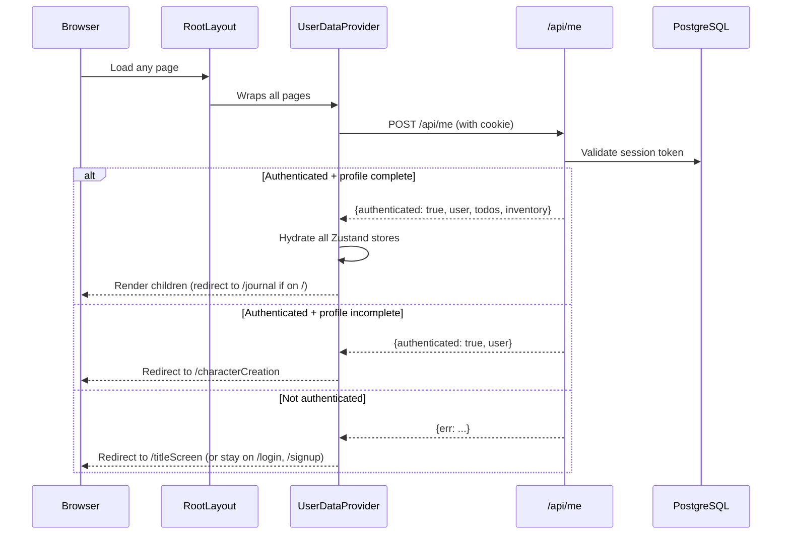
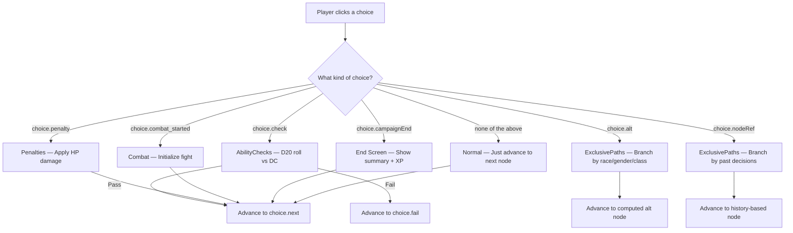
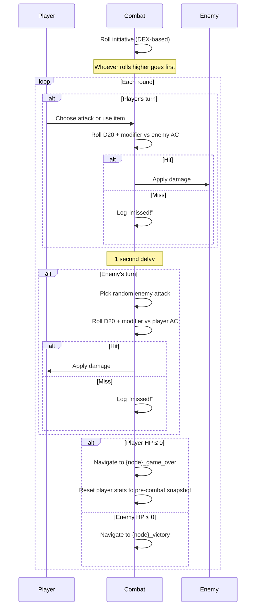
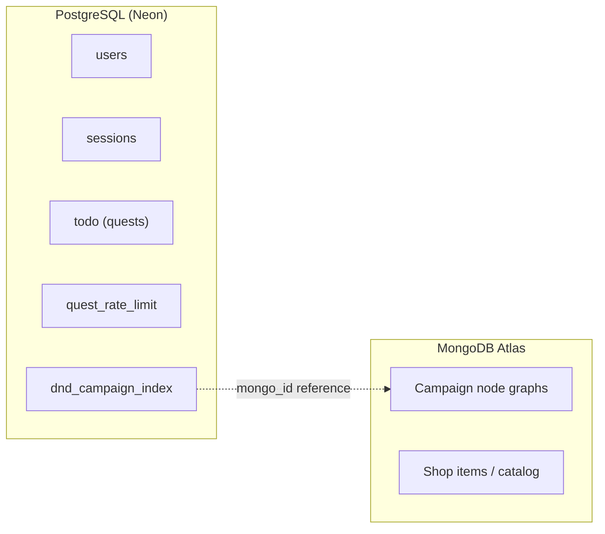
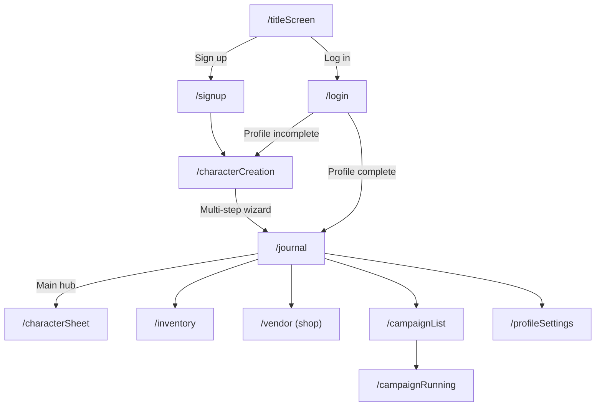

# Questmaker — Codebase Walkthrough

## What Is It?

Questmaker is a **productivity app with a D&D RPG layer on top**. Users create a character (race, class, ability scores), complete real-life tasks ("quests") to earn coins, spend coins in a shop, and play through a text-based D&D campaign as their avatar.

**Live demo:** [questmaker2.vercel.app](https://questmaker2.vercel.app)

---

## Tech Stack

| Layer | Technology |
|---|---|
| Framework | **Next.js 16** (App Router, client-heavy) |
| Language | TypeScript |
| Styling | Tailwind CSS + [pixel-retroui](https://www.npmjs.com/package/pixel-retroui) (retro pixel-art UI lib) |
| State management | **Zustand** (6 stores) |
| Relational DB | **PostgreSQL** via Neon serverless (`postgres` driver) |
| Document DB | **MongoDB Atlas** (campaign content) |
| Auth | Session-based (HTTP-only cookies, custom implementation) |
| Deployment | Vercel |

---

## Project Structure

```
app/                    # Next.js App Router pages + API routes
├── api/                # REST API endpoints
│   ├── campaigns/      # Campaign data (MongoDB-backed)
│   ├── csrf/           # CSRF token endpoint
│   ├── inventory/      # Inventory CRUD
│   ├── login/          # Auth: login
│   ├── logout/         # Auth: logout
│   ├── me/             # Auth: session check, returns user data
│   ├── profileSettings/# Profile updates
│   ├── todo/           # Quest/task CRUD + rate limiting
│   ├── users/          # User CRUD + consumable usage
│   └── xp/             # XP management
├── campaignList/       # Campaign selection page
├── campaignRunning/    # Active campaign playthrough page
├── characterCreation/  # Multi-step character creation wizard
├── characterSheet/     # Character stat sheet view
├── inventory/          # Inventory page
├── journal/            # Main quest/task management page
├── login/              # Login page
├── signup/             # Signup page
├── titleScreen/        # Landing / title screen
├── vendor/             # Shop page (buy items with coins)
└── profileSettings/    # Profile settings page

classes/                # Business logic classes
├── Engine.tsx          # 🎮 Central campaign engine (node navigation)
├── AbilityChecks.tsx   # D20 ability check resolver
├── Choices.tsx         # Choice filtering & dynamic text injection
├── ExclusivePaths.tsx  # Branching paths based on race/gender/class/history
├── Penalties.tsx       # HP penalty handler
├── Character.tsx       # Character creation & stat calculation
├── Quest.tsx           # Quest CRUD operations
├── Item.tsx            # Consumable item usage
└── CombatSystem/       # Turn-based combat system
    ├── Combat.tsx      # Core combat loop (initiative, turns, win/lose)
    ├── Enemy.tsx       # Enemy data factory
    ├── useAttackAction.tsx      # Player attack resolution
    └── useConsumableAction.tsx  # In-combat item usage

stores/                 # Zustand state stores
├── useUserStore.ts           # Current user, stats, attacks
├── useNarrationStore.ts      # Campaign nodes, current node pointer
├── useCombatStore.ts         # Combat log, enemy, turn tracking
├── useInventoryStore.ts      # Player inventory
├── useJournalStore.ts        # Quest list, pagination
└── useCharacterCreationStore.ts  # Draft character during creation

context/context.tsx     # Auth context provider (session bootstrapping)
server/connexion.ts     # PostgreSQL connection (Neon)
lib/mongodb.ts          # MongoDB connection (Atlas)
middlewares/            # Input validation & helpers
types/types.tsx         # All shared TypeScript types
```

---

## Authentication Flow



The `UserDataProvider` in [context.tsx](file:///home/lavarde/Bureau/questmaker/context/context.tsx) is the **first thing that runs** on every page load. It calls `/api/me`, then hydrates all the Zustand stores (`useUserStore`, `useJournalStore`, `useInventoryStore`) before rendering any child components.

---

## Zustand Stores (State Management)

### 1. [useUserStore](file:///home/lavarde/Bureau/questmaker/stores/useUserStore.ts)
The central user store. Holds the full `User` object with all D&D stats (str, dex, con, int, wis, cha), HP, XP, coins, class, race, etc. Key actions: `login`, `logout`, `updateProfile`, `updateStats`, `addXp`, `addDamage`.

### 2. [useNarrationStore](file:///home/lavarde/Bureau/questmaker/stores/useNarrationStore.ts)
Drives the campaign. Holds the current campaign's node graph (`Nodes`), the campaign title, and the **current node pointer** (`currentNode`). The `updateNode` action is what advances the story.

### 3. [useCombatStore](file:///home/lavarde/Bureau/questmaker/stores/useCombatStore.ts)
Combat-specific state: combat log (HTML string), enemy encounter data, turn counter, combat on/off flag, round status, combat menu navigation, and inventory overlay toggle.

### 4. [useInventoryStore](file:///home/lavarde/Bureau/questmaker/stores/useInventoryStore.ts)
Simple array of `Item` objects (slug + quantity). Supports `updateInventory` (full replace) and `decrementInventory` (use one item).

### 5. [useJournalStore](file:///home/lavarde/Bureau/questmaker/stores/useJournalStore.ts)
Quest/task list management with pagination. Holds `allQuests`, `displayedQuests`, and a page counter for paging through tasks.

### 6. [useCharacterCreationStore](file:///home/lavarde/Bureau/questmaker/stores/useCharacterCreationStore.ts)
Temporary `Draft` object used during character creation. Manages ability score point-buy (5 points to distribute, base 10 per stat).

---

## The Campaign Engine

The campaign system is the core feature. Campaign content is stored in **MongoDB** as a graph of **nodes**, each with narrative text and an array of **choices**.

### Node Structure (from MongoDB)
```typescript
type Node = {
  text: string;          // Narrative text displayed to the player
  choices?: Choice[];    // Array of available player choices
  effects?: Record<string, unknown>;
  type?: string;
  condition?: string;
};
```

### How the Engine Works

The [Engine](file:///home/lavarde/Bureau/questmaker/classes/Engine.tsx) class is the **central orchestrator**. When a player makes a choice, `determineNextNode()` inspects the choice properties and delegates to the appropriate handler:



### Sub-Systems

#### [AbilityChecks](file:///home/lavarde/Bureau/questmaker/classes/AbilityChecks.tsx)
Classic D&D ability check: rolls a D20, adds the relevant stat modifier `floor((stat - 10) / 2)`, compares against the choice's DC (difficulty class). Returns `{result: bool, value: roll}`.

#### [ExclusivePaths](file:///home/lavarde/Bureau/questmaker/classes/ExclusivePaths.tsx)
Handles branching narrative paths:
- **By race/gender/class**: If a choice has an `alt` array, it checks the user's race, gender, or class and appends a suffix to the node name (e.g., `node_elf`, `node_female`).
- **By past decisions** (`nodeRef`): Builds a node key from which past decision-nodes the player has visited (e.g., `node[decision1+decision3]`).

#### [Choices](file:///home/lavarde/Bureau/questmaker/classes/Choices.tsx)
Filters and transforms choices before display:
1. **Removes already-picked choices** (prevents loops), except "locked" choices like `[CONTINUE]` and `[START COMBAT]`.
2. **Injects dynamic text** — replaces `[USERNAME]` and `[RACE]` placeholders with the player's actual values.

#### [Penalties](file:///home/lavarde/Bureau/questmaker/classes/Penalties.tsx)
Applies stat penalties (currently HP damage) when a choice carries a `penalty` property.

---

## Combat System

The [Combat](file:///home/lavarde/Bureau/questmaker/classes/CombatSystem/Combat.tsx) class implements a **turn-based combat system** with D&D mechanics:



Key design details:
- **Initiative**: DEX-based D20 roll, recursive on ties
- **Attack rolls**: D20 + modifier, compared against target's AC
- **Sound effects**: Each attack/miss triggers a sound effect callback
- **Combat lock**: `combatLockOn` prevents spamming attacks during animation delays
- **Game over recovery**: Pre-combat stats are snapshotted and restored on defeat
- **In-combat inventory**: Players can open inventory and use consumables mid-fight

---

## Quest System (Productivity Layer)

The [Quest](file:///home/lavarde/Bureau/questmaker/classes/Quest.tsx) class handles the todo/task system:
- **Insert**: Creates a new task via `POST /api/todo/`
- **Complete**: Toggles completion via `PATCH /api/todo/:id` (awards coins/XP)
- **Delete**: Removes a task via `DELETE /api/todo/:id`
- **Rate limiting**: A `quest_rate_limit` table caps completions at 5 per hour per user (prevents coin farming)

---

## Character Creation

The [Character](file:///home/lavarde/Bureau/questmaker/classes/Character.tsx) class handles new character setup:
1. Player picks username, gender, race, class
2. Player distributes **5 bonus ability points** across 6 stats (base 10 each)
3. On submission, the class calculates derived stats:
   - **HP** = `10 + CON modifier`
   - **AC** = `10 + DEX modifier`
   - **Dopamine** (action resource) = `20 + main-class-ability modifier`
4. Profile is saved via `PATCH /api/users/:id`, and the user object is built from the draft

---

## Dual Database Architecture



- **PostgreSQL** stores all relational data: users, sessions, quests, rate limits, and a campaign index table that maps campaign names to MongoDB document IDs.
- **MongoDB** stores the campaign content (node graphs with narrative text, choices, and branching logic) and the item shop catalog.

---

## API Routes

| Route | Methods | Purpose |
|---|---|---|
| `/api/me` | POST | Session validation, returns user + todos + inventory |
| `/api/login` | POST | Authenticate with email/password |
| `/api/logout` | POST | Destroy session |
| `/api/csrf` | GET | CSRF token |
| `/api/users` | POST | Create user |
| `/api/users/[id]` | PATCH, PUT | Update profile / save campaign data |
| `/api/users/consumable/[id]` | PATCH | Use a consumable item |
| `/api/todo` | POST | Create quest |
| `/api/todo/[id]` | PATCH, DELETE | Complete/uncomplete or delete quest |
| `/api/campaigns/[id]` | GET | Fetch campaign content from MongoDB |
| `/api/campaigns/list` | GET | List available campaigns |
| `/api/inventory/[id]` | GET, PUT | Read/save inventory |
| `/api/xp` | PATCH | Award XP |
| `/api/profileSettings` | PATCH | Update profile settings |

---

## App Pages (User Flow)



- **Title screen** → Login/Signup
- **Character creation** → Multi-step wizard (only for new users)
- **Journal** → Main hub — create/complete quests, earn coins
- **Vendor** → Spend coins on items (stored in MongoDB catalog)
- **Campaign list** → Pick a campaign chapter
- **Campaign running** → Play through the text adventure (Engine + Combat)
- **Character sheet** → View your D&D stats
- **Inventory** → View owned items, use consumables

